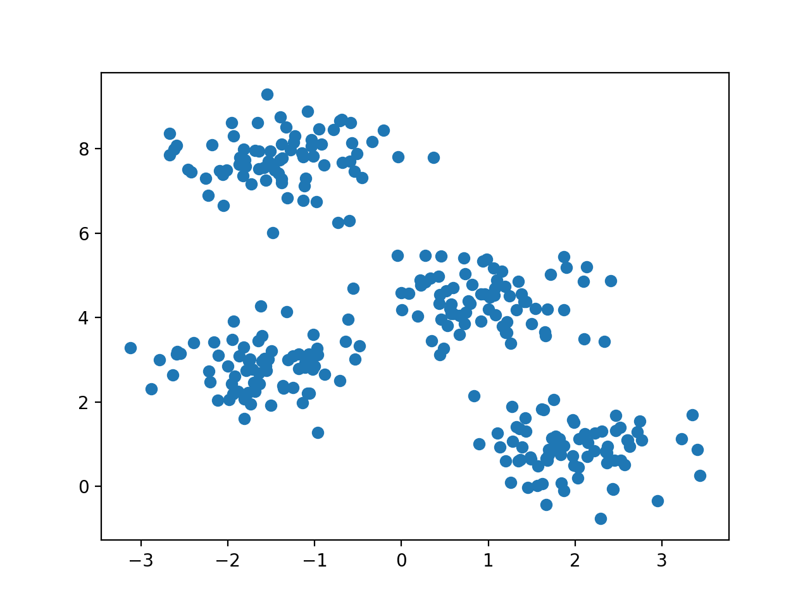
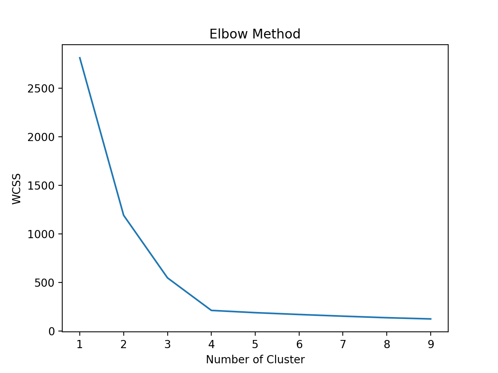

# Study_kmeans
Find optimum k value and use it for k-means algorithm
tutorial from
https://towardsdatascience.com/solving-a-simple-classification-problem-with-python-fruits-lovers-edition-d20ab6b071d2

Data

Optimum K

Centroid

